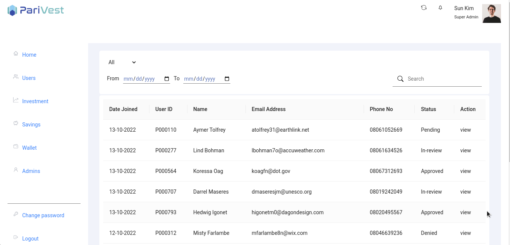

# Parivest Dashboard

> A dashboard app for monitoring users infos with detail view on each user that pulls data from a remote API endpoint, built with NextJS, CSS & Ant Design.

Additional description about the project and its features.



## Link to App

- [Parivest Dashboard](https://parivest-dashboard-xhk3.vercel.app/users)

## Built With

- Major language
  - NextJS
  - CSS
  - Ant Design
  - Axios

- Technologies used

```bash
- Git(version control)
```

## Getting Started

To get a local copy up and running follow these simple example steps.


### Prerequisites

- A text editor(preferably Visual Studio Code)

### Install

- [Git](https://git-scm.com/downloads)
- [Node.js](https://nodejs.org/en/download/)

### Usage

#### Clone this repository

```bash
git clone
$ https://github.com/netman5/parivest-dashboard.git
$ cd parivest-dashboard
```
To start the app, run the following command:

```bash
npm run dev
```

#### Run project

```bash
- npm install
```

## Author

👤 **Ola Ishola**

- GitHub: [@netman5](https://github.com/netman5)
- Twitter: [@Orlaish](https://twitter.com/Orlaish)
- LinkedIn: [LinkedIn](https://www.linkedin.com/in/ola-ishola/)

## 🤝 Contributing

Contributions, issues, and feature requests are welcome!

Feel free to check the [issues page](https://github.com/netman5/parivest-dashboard/issues).

## Show your support

Give a ⭐️ if you like this project!

## Acknowledgments

- To the beautiful people at Parivest, Thank you for the opportunity.

## 📝 License

This project is [MIT](https://opensource.org/licenses/MIT) licensed.